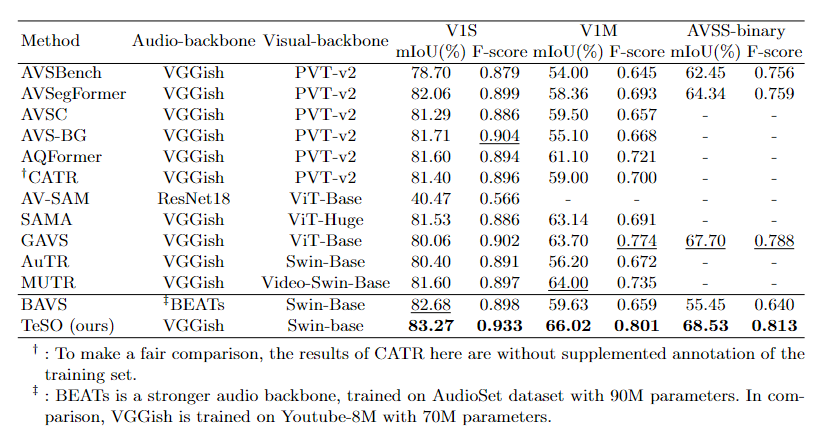

# Sounding-Object-Segmentation-Preference
The official repo for "Can Textual Semantics Mitigate Sounding Object Segmentation Preference?", ECCV 2024

arXiv: TO BE DONE

# Abstract
The Audio-Visual Segmentation (AVS) task aims to segment sounding objects in the visual space using audio cues.However, in this work, it is recognized that previous AVS methods show a heavy reliance on detrimental segmentation preferences related to audible objects, rather than precise audio guidance. We argue that the primary reason is that audio lacks robust semantics compared to vision, especially in multi-source sounding scenes, resulting in weak audio guidance over the visual space.Motivated by the the fact that text modality is well explored and contains rich abstract semantics, we propose leveraging text cues from the visual scene to enhance audio guidance with the semantics inherent in text. Our approach begins by obtaining scene descriptions through an off-the-shelf image captioner and prompting a frozen large language model to deduce potential sounding objects as text cues.Subsequently, we introduce a novel semantics-driven audio modeling module with a dynamic mask to integrate audio features with text cues, leading to representative sounding object features.These features not only encompass audio cues but also possess vivid semantics, providing clearer guidance in the visual space. Experimental results on AVS benchmarks validate that our method exhibits enhanced sensitivity to audio when aided by text cues, achieving highly competitive performance on all three subsets.

# Highlight

### Motivation

From the experiment with manually muted audio input, we observe that most of the behavior of AVS baselines depends on the segmentation preference established during the training process rather than relying on reliable audio-visual correlation. For instance, these models tend to take a shortcut by segmenting out the muted guitars because the audio guidance is weak, and they simply learned with the easy-to-learn visual feature alone (\ie, shortcut learning) that guitars are often associated with sound-emitting during the training phase. The unreliable audio-visual correlation can be attributed to two main factors. Firstly, the scarcity of training data for AVS is a significant challenge due to the demanding nature of pixel-level annotation. Secondly, the audio modality itself presents inherent complexity and ambiguity, especially in scenarios involving multiple audio sources that may be intertwined. 


# 1. Model architecture


In essence, they learn which objects are most likely audible during training and take shortcuts during inference. To address the above issue, our method aims to enhance the audio-visual correlation by leveraging the text modality, which inherently possesses robust semantic information, to obtain finer-grained audio guidance. We begin by acquiring detailed scene descriptions through an off-the-shelf image captioner. Subsequently, a frozen LLM works as the text cues capturer, collecting potential sounding objects as text cues from the scene descriptions with CoT instructions. Finally, we introduce a novel SeDAM module with a dynamic mask to seamlessly integrate audio features and text semantics through a crossmodal transformer, providing finer audio guidance with text semantic cues. 

# 3. Experiments
## 3.1 AVS-Benchmarks

**Performance on AVS-Benchmarks**



**Performance on AVSS**


## 3.2Segmenatation Preference


This observation suggests that the models might rely more on the segmentation preferences formed during the training rather than truly learning efficient audio guidance.

# 4. Qualitative results


Examples of the impact of normal audio input and all-mute audio on popular methods. In normal scenarios, our method shows better masks than previous methods. In all-mute scenarios, our approach exhibits strong sensitivity towards audio inputs, as it is capable of generating blank masks for silent audio clips.


# 5. Run


# 6. Citation

```
@article{wang2024segpref,
          title={Can Textual Semantics Mitigate Sounding Object Segmentation Preference?},
          author={Yaoting Wang, Peiwen Sun, Yuanchao Li, Honggang Zhang, Di Hu},
          journal={IEEE European Conference on Computer Vision (ECCV)},
          year={2024},
        }
```
